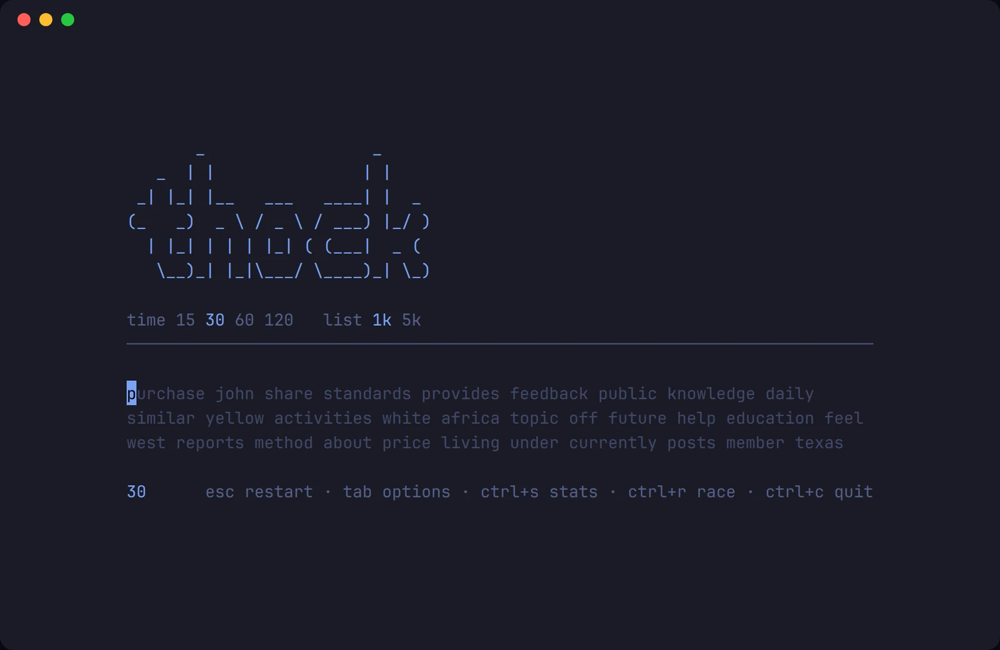
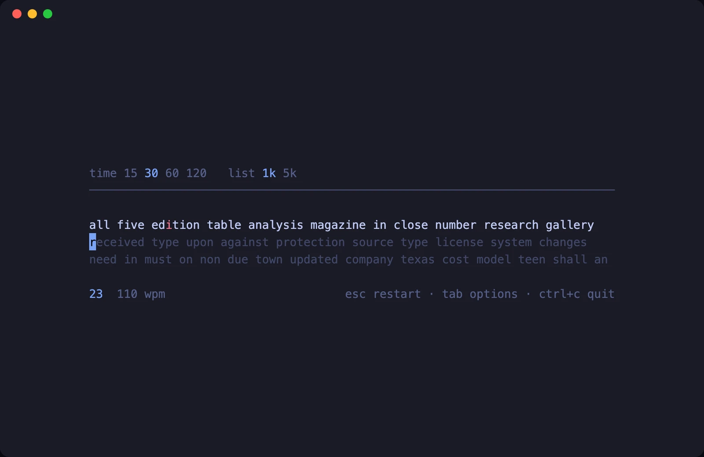
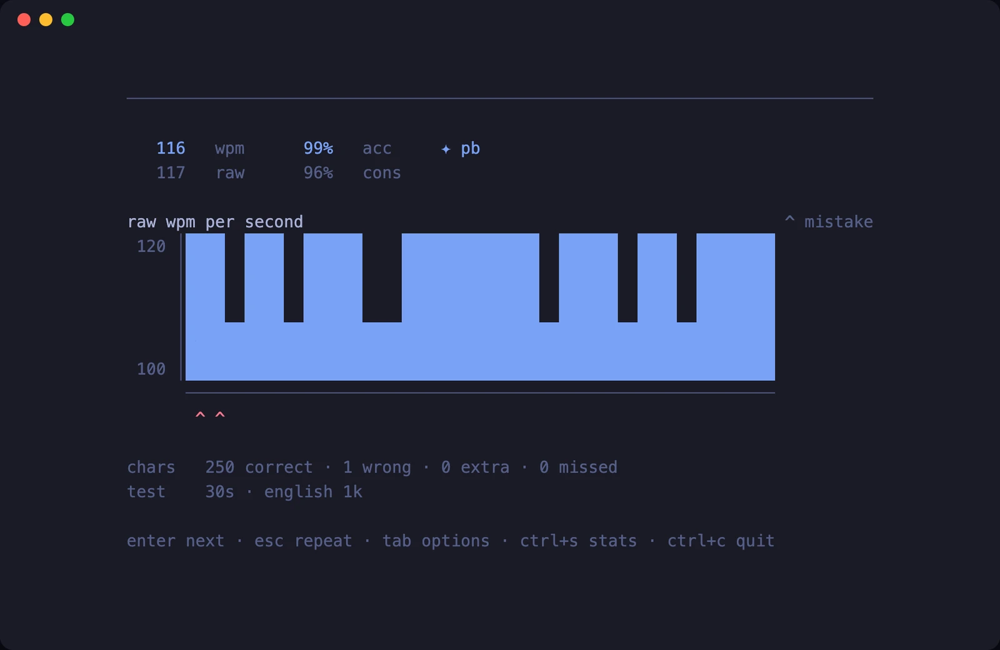
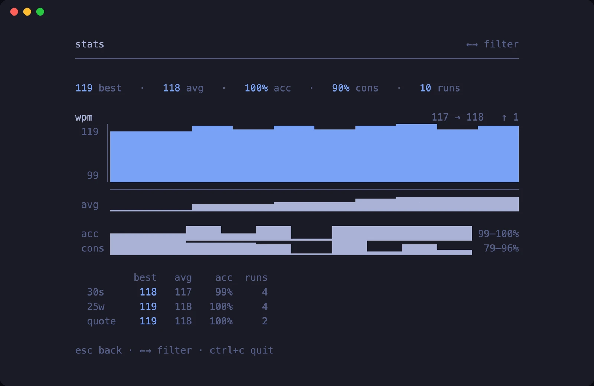

# thock

A typing test for the terminal, with Monkeytype's scoring.



Run it and start typing. There is no menu to get through first.

## Features

- Monkeytype's formulas, so wpm, raw, accuracy and consistency match monkeytype.com.
- Time, words and quotes modes, on a 1k or 5k word list.
- A stats screen with every run, trend lines and personal bests per setup.
- Ten themes, one of which uses your terminal's own palette, and full `NO_COLOR` support.
- Results stay on your machine in an append-only log.
- About 4 µs of work per keystroke, redrawing at up to 120 FPS.

## Screenshots

| Mid-test | Results after a 30s test |
| :-: | :-: |
|  |  |

## Stack

Go, Bubble Tea v2, Cobra.

## Install

```sh
go install github.com/dawsonxiong/thock@latest
```

Or from a clone:

```sh
go build -o thock . && ./thock
```

Requires Go 1.25 or newer.

## Usage

```sh
thock                     # 30 second test on the 1k word list
thock --time 60           # 15, 30, 60 or 120 seconds
thock --words 50          # 10, 25, 50 or 100 words
thock --mode quotes       # a famous line from a film, book or show
thock --list 5k           # wider vocabulary
thock --theme gruvbox     # see `thock themes`
thock stats               # personal bests and recent runs
```

Naming a limit picks the mode that uses it, so `--words 50` needs no `--mode`.

## Keys

| Key | |
|---|---|
| `esc` | restart with the same text |
| `enter` | new text (on the results screen) |
| `tab` | options — `enter` there applies and restarts, `esc` backs out |
| `ctrl+s` | stats — `←→` filters, `esc` goes back |
| `ctrl+w` | delete the last word |
| `ctrl+c` | quit |

The results screen ignores printable characters on purpose. Momentum
keystrokes landing after your final word should not skip you past your own
result.

## Stats

`ctrl+s` opens the stats screen from an idle test or from a result, and `esc`
gives back whichever you came from. It shows one bar per run with a smoothed
line beneath, accuracy and consistency as their own tracks, and a table of
bests, averages and run counts per setup:



The filter cycles through the setups you have actually recorded. Groups are
never pooled: a 30 second run is only comparable with other 30 second runs, the
same rule the personal bests use.

The two sparkline rows stretch their eight levels across whatever range the data
has, so each is labelled with its own bounds — accuracy lives in a narrow band
near the top of its scale, and unlabelled that would read as violent swings.

`ctrl+s` does nothing once the clock is running. There is no way back into a
test mid-flow, so opening stats would quietly cost you the run.

`thock stats` prints bests, a trend line and recent results without starting the
interface.

## Scoring

The formulas are Monkeytype's, so the numbers are comparable to scores from
monkeytype.com:

- **wpm** — correctly entered characters plus one space per perfectly typed
  word, divided by five, per minute
- **raw** — everything entered, scored the same way
- **accuracy** — measured over keystroke history rather than the final text, so
  a mistake you corrected still costs you
- **consistency** — `kogasa` applied to the coefficient of variation of
  per-second raw speed, using the population standard deviation

Characters skipped by an early space count against speed but not accuracy: no
key was ever pressed for them.

## Performance

Bubble Tea redraws at up to 120 FPS, so the number that matters is how much work one keystroke costs before the next frame can go out. `internal/ui/bench_test.go` measures it:

```
go test ./internal/ui -bench 'Keystroke|View' -benchmem
```

On an Apple M4 with Go 1.27 (2026-09-22), a 120x40 terminal, words mode with the 1k list:

| Benchmark | Time | Allocations |
|---|---|---|
| Keystroke (one key press through `Update`, then `View`) | ~4.1 us | 43 |
| View alone (build one frame) | ~1.5 us | 36 |

That is about 2,000x under the 8.3 ms frame budget at 120 FPS, so input latency is bounded by the terminal, not by thock.

## Themes

Ten built in — `mono` (default), `amber`, `neon`, `terminal`, `catppuccin`,
`gruvbox`, `nord`, `dracula`, `tokyonight` and `rosepine`. Run `thock themes`
to see them with live colour samples.

`terminal` uses only ANSI 0–15, so it inherits whatever palette your terminal
already has.

`NO_COLOR` and `--no-color` are both honoured. In that mode state is carried by
underline and dim rather than by hue, so the test stays fully playable with no
colour at all.

## Files

| Path | |
|---|---|
| `~/.config/thock/config.toml` | theme and last-used test settings |
| `~/.local/share/thock/results.jsonl` | one JSON object per finished test |

Both honour `XDG_CONFIG_HOME` and `XDG_DATA_HOME`. The results log is
append-only and greppable; nothing is ever sent anywhere.

## Not affiliated with Monkeytype

thock borrows Monkeytype's scoring formulas so the numbers mean the same thing.
It is a separate program, it does not talk to monkeytype.com, and results
recorded here are local to your machine.

## Licence

MIT
